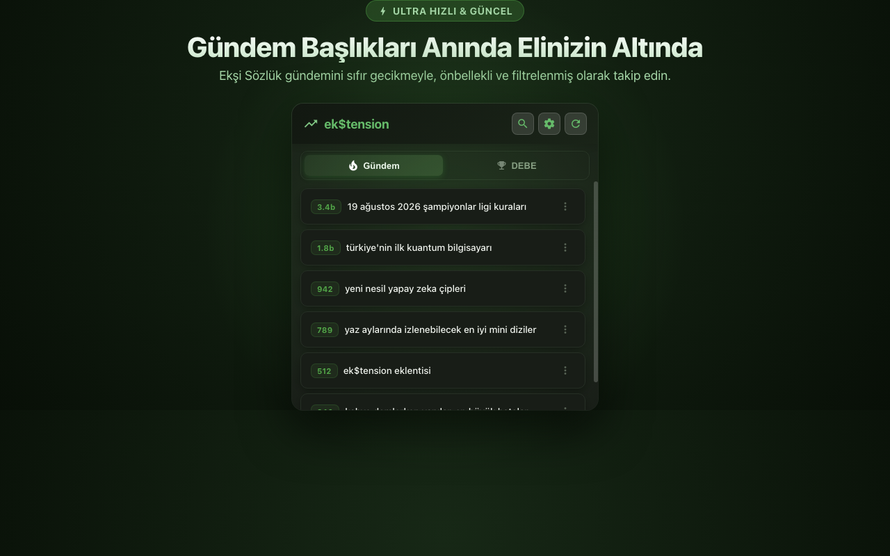
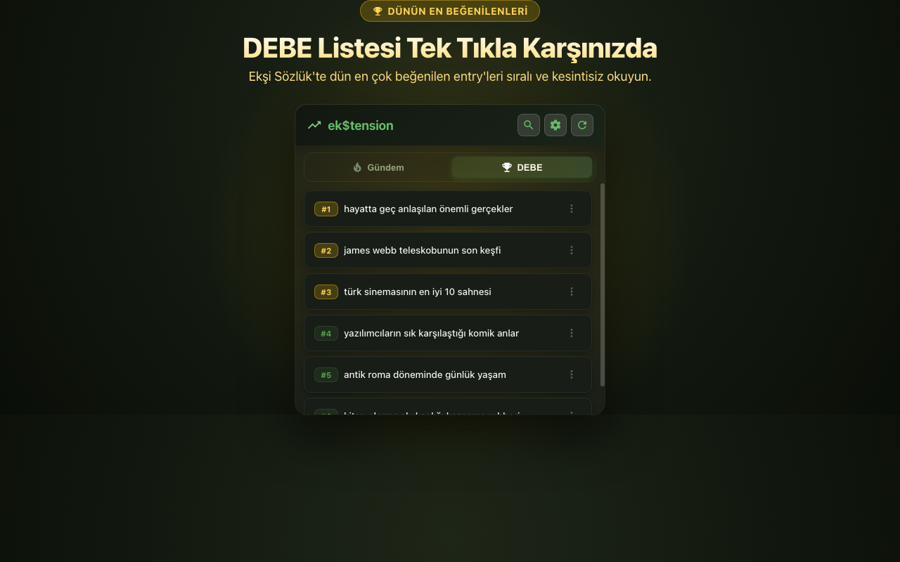
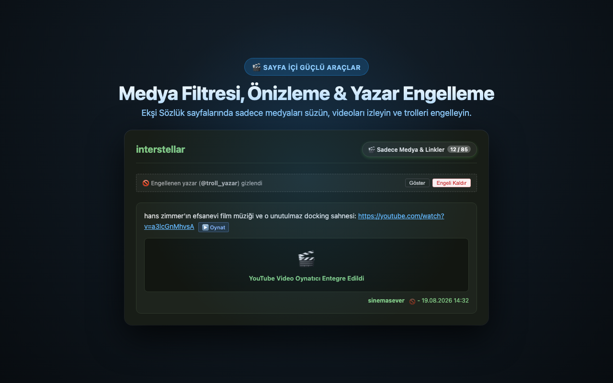
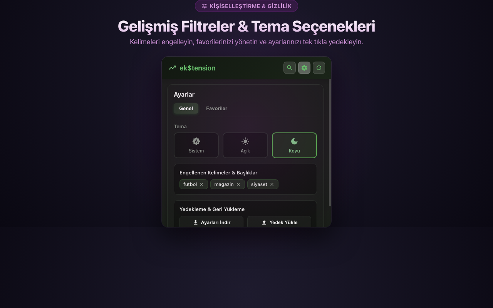

<div align="center">

# ⚡ ek$tension

### <i>Ekşi Sözlük için Yeni Nesil Güç Araçları & Google Gemini AI Destekli Chrome Eklentisi</i>

<p align="center">
  <a href="https://github.com/emreuluduz/ekstension/releases">
    
  </a>
  <a href="manifest.json">
    
  </a>
  <a href="https://aistudio.google.com/">
    
  </a>
  <a href="LICENSE">
    
  </a>
  <a href="https://github.com/emreuluduz/ekstension/pulls">
    
  </a>
</p>

<br />

<p align="center">
  
</p>

<p align="center">
  <a href="#-özellikler--features">Özellikler</a> •
  <a href="#%EF%B8%8F-ekran-görüntüleri--preview">Önizleme</a> •
  <a href="#%EF%B8%8F-teknoloji-yığını--tech-stack">Teknoloji</a> •
  <a href="#-proje-mimarisi--project-structure">Proje Yapısı</a> •
  <a href="#-kurulum--installation">Kurulum</a> •
  <a href="#%EF%B8%8F-klavye-kısayolları--shortcuts">Kısayollar</a> •
  <a href="#-katkıda-bulunma--contributing">Katkıda Bulunma</a> •
  <a href="#-lisans--license">Lisans</a>
</p>

---

</div>

## 📌 Genel Bakış / Overview

> [!NOTE]
> **ek$tension**, Ekşi Sözlük deneyimini modern web standartlarına taşıyan; yapay zeka destekli özetleme motoru (Google Gemini), sayfa içi güç araçları (In-page power tools), medya filtreleri ve klavye navigasyonu sunan kapsamlı ve hafif bir Chrome uzantısıdır.

---

## 📑 İçindekiler / Table of Contents

- [📌 Genel Bakış / Overview](#-genel-bakış--overview)
- [🚀 Özellikler / Features](#-özellikler--features)
  - [⚡ Google Gemini AI Özetleyici](#-google-gemini-ai-özetleyici-gemini-35-flash-lite)
  - [🧰 In-Page Power Tools (Sayfa İçi Araçlar)](#-in-page-power-tools-sayfa-içi-araçlar)
  - [🔍 Gelişmiş Arama & Çoklu Platform Entegrasyonu](#-gelişmiş-arama--çoklu-platform-entegrasyonu)
  - [⚙️ Yedekleme, Tema & Kişiselleştirme](#️-yedekleme-tema--kişiselleştirme)
- [🖼️ Ekran Görüntüleri / Preview](#%EF%B8%8F-ekran-görüntüleri--preview)
- [🛠️ Teknoloji Yığını / Tech Stack](#%EF%B8%8F-teknoloji-yığını--tech-stack)
- [📂 Proje Mimarisi / Project Structure](#-proje-mimarisi--project-structure)
- [📦 Kurulum / Installation](#-kurulum--installation)
- [⌨️ Klavye Kısayolları / Shortcuts](#%EF%B8%8F-klavye-kısayolları--shortcuts)
- [🤝 Katkıda Bulunma / Contributing](#-katkıda-bulunma--contributing)
- [📄 Lisans / License](#-lisans--license)

---

## 🚀 Özellikler / Features

### ⚡ Google Gemini AI Özetleyici (Gemini 3.5 Flash Lite)
- **Başlık & Tartışma Özetleyici (`⚡ Başlığı Özetle`):** Onlarca sayfadan oluşan uzun tartışma başlıklarındaki tüm entry'leri tarar. Google'ın resmi **Gemini 3.5 Flash Lite** modeli ile tartışmanın ana fikrini, farklı perspektifleri ve öne çıkan ortak kanıları saniyeler içinde madde madde özetler.
- **Tekil Entry Özetleyici (`⚡ Özetle`):** 500 karakterden uzun kapsamlı entry'lerin altında beliren buton ile anında 1-2 maddelik hap özet üretir.
- **Bulut Hızı & Sıfır Donanım Yükü:** Tüm işlemler Google'ın güvenli altyapısında çalışır; bilgisayarınızı yormaz, 1.5 - 2 saniyede sonuç verir.
- **%100 Ücretsiz API Desteği:** Google AI Studio üzerinden alınan ücretsiz API anahtarı ile kolayca çalışır ([Kurulum Rehberi](docs/GEMINI_API_KEY_SETUP.md)).

---

### 🧰 In-Page Power Tools (Sayfa İçi Araçlar)
- **♾️ Sonsuz Kaydırma & Canlı Akış (Infinite Scroll & Live Stream):** Çok sayfalı başlıklarda sayfalar arasında kaybolmadan kesintisiz akış (`?p=2`); maç ve canlı olay başlıklarında sayfayı yenilemeden yeni entry'leri anlık akıtma (`🔴 Canlı Akış`).
- **🔖 Tekil Entry Kaydetme & Okuma Listesi (Read Later):** Entry altındaki `🔖 Kaydet` butonuyla yerel arşivleme, yan çekmece (Slide Drawer) üzerinden yönetim ve **Markdown (.md)** / **JSON** formatında dışa aktarma.
- **🧘 Zen / Odaklanma Modu (Reader Mode):** Reklamları, sol menüyü ve dikkat dağıtıcı öğeleri gizleyen; ayarlanabilir ferah genişlik ve tipografiye sahip temiz okuma modu (`🧘 Zen Modu` / `Z`).
- **👁️ Entry Bkz Hover Preview:** `(bkz: #173073218)` veya doğrudan entry bağlantılarının üzerine gelindiğinde sayfadan ayrılmadan entry metnini, yazarını ve tarihini gösteren akıllı önizleme kartı.
- **🎬 Medya & Link Filtresi:** Başlık sayfalarında tek tıkla (`[ 🎬 Sadece Medya & Linkler ]`) metin ağırlıklı entry'leri gizleyip sadece görsel, video veya harici link içeren entry'leri listeleme.
- **🖼️ Satır İçi Medya Önizleme:** YouTube videolarını, görsel bağlantılarını (`soz.lk`, `eksisozluk.com/img/`, `.jpg`, `.png`, `hizliresim`, `imgur`, `ibb.co`, `resmim.net`) sayfadan ayrılmadan doğrudan entry içinde görüntüleme ve oynatma.
- **🚫 1-Tıkla Yazar / Troll Engelleme:** İstenmeyen yazarları tek tıkla (`🚫`) engelleme ve gizleme.

---

### 🔍 Gelişmiş Arama & Çoklu Platform Entegrasyonu
- **Sağ Tık Hızlı Arama:** Herhangi bir web sitesinde seçili metne sağ tıklayarak doğrudan Ekşi Sözlük'te arama yapma.
- **Akıllı Arama Çubuğu:** Başlıklar ve yazarlar için gerçek zamanlı otomatik tamamlama.
- **Çoklu Platform Kısayolları:** Tek tıkla ilgili başlığı popüler platformlarda sorgulama:
  - 🎥 **YouTube** • 📚 **Wikipedia** • 🎬 **IMDb** • 🎮 **Steam** • 🕹️ **Epic Games**

---

### ⚙️ Yedekleme, Tema & Kişiselleştirme
- **Karanlık, Aydınlık & Otomatik Tema:** Sistem tercihine duyarlı modern arayüz tasarımı.
- **JSON Yedekleme & Geri Yükleme:** Tüm favori başlıkları, engellenen kelimeleri ve yazarları tek tıkla dışa/içe aktarma.
- **Cloudflare Doğrulama Asistanı:** Bot koruması devreye girdiğinde kesintisiz oturum desteği.

---

## 🖼️ Ekran Görüntüleri / Preview

| Gündem & Canlı Akış | DEBE & Okuma Listesi |
| :---: | :---: |
|  |  |
| **Sayfa İçi Güç Araçları** | **Karanlık Mod & Ayarlar** |
|  |  |

---

## 🛠️ Teknoloji Yığını / Tech Stack

<div align="left">
  
  
  
  
  
  
</div>

<br />

| Bileşen | Detaylar |
| :--- | :--- |
| **Mimari Standartı** | Chrome Extensions **Manifest V3** (Service Worker + Offscreen Documents) |
| **Yapay Zeka** | Google Gemini REST API (`gemini-2.5-flash` / `gemini-3.5-flash-lite`) |
| **Ön Yüz & Tasarım** | Vanilla JavaScript (ES Modules), Custom CSS3 Variables, Material Icons |
| **Ağ & Filtreleme** | DeclarativeNetRequest API, Chrome Storage API, Regex Parser |

---

## 📂 Proje Mimarisi / Project Structure

```bash
ekstension/
├── 📁 _locales/                  # Çok dilli yerelleştirme dosyaları (tr / en)
│   ├── 📁 en/messages.json
│   └── 📁 tr/messages.json
├── 📁 assets/                    # Medya varlıkları & ekran görüntüleri
│   └── 📁 screenshots/
├── 📁 icons/                     # Eklenti ve platform entegrasyon ikonları
├── 📁 src/                       # Kaynak kodlar
│   ├── 📁 actions/               # Popup arayüzü & Ayarlar paneli
│   │   ├── 📁 css/               # Popup stilleri & temalar
│   │   ├── 📁 js/                # UI kontrolcüleri, önbellek ve arama modülleri
│   │   └── 📄 index.html         # Ana popup görünümü
│   ├── 📁 background/            # Background Service Worker & yaşam döngüsü
│   │   ├── 📄 background.js      # Olay dinleyicileri & bağlam menüleri
│   │   └── 📄 topics.js          # Gündem ve veri ayrıştırıcılar
│   └── 📁 content/               # Web sayfası içi scriptler (DOM Enjeksiyonu)
│       ├── 📄 content.css        # Sayfa içi stiller
│       ├── 📄 filter.js          # Yazar & kelime engelleyicisi
│       └── 📁 power-tools/       # Modüler güç araçları
│           ├── 📄 bookmarks.js       # Entry kaydetme & dışa aktarma
│           ├── 📄 infinite-scroll.js # Sonsuz kaydırma & Canlı akış
│           ├── 📄 keyboard-nav.js    # Klavye kısayol yöneticisi
│           ├── 📄 zen-mode.js        # Zen / Odaklanma okuma modu
│           └── 📄 power-tools.css    # Güç araçları stil tanımları
├── 📄 manifest.json              # Extension Manifest V3 yapılandırması
├── 📄 rules.json                 # DeclarativeNetRequest ağ kuralları
├── 📄 PRIVACY_POLICY.md          # Gizlilik Politikası
└── 📄 README.md                  # Proje dokümantasyonu
```

---

## 📦 Kurulum / Installation

### 1. Depoyu Klonlayın veya İndirin
```bash
git clone https://github.com/emreuluduz/ekstension.git
```
*(veya GitHub üzerinden **ZIP** olarak indirip klasöre çıkartın)*

### 2. Tarayıcıya Yükleyin (Chrome / Brave / Edge / Arc)
1. Tarayıcınızın adres çubuğuna `chrome://extensions/` yazın ve Enter'a basın.
2. Sağ üst köşedeki **Geliştirici modu (Developer mode)** anahtarını açın.
3. Sol üstteki **Paketlenmemiş öge yükle (Load unpacked)** butonuna tıklayın.
4. İndirdiğiniz `ekstension` klasörünü seçin.

> [!TIP]
> Gemini AI özelliklerini kullanabilmek için [Google AI Studio](https://aistudio.google.com/)'dan ücretsiz alacağınız API anahtarını eklenti Ayarlar bölümünden eklemeniz yeterlidir.

---

## ⌨️ Klavye Kısayolları / Shortcuts

Ekşi Sözlük sayfalarında gezinirken fareye dokunmadan hızlı hareket edin:

| Tuş | Fonksiyon |
| :---: | :--- |
| <kbd>J</kbd> | Sonraki entry'ye odaklan |
| <kbd>K</kbd> | Önceki entry'ye odaklan |
| <kbd>S</kbd> | Odaklanılan entry'yi **Okuma Listesi'ne kaydet** |
| <kbd>E</kbd> | Odaklanılan entry'yi **Gemini AI ile özetle** |
| <kbd>Z</kbd> | **Zen / Okuma Modu**'nu aç / kapat |
| <kbd>?</kbd> | Klavye kısayolları yardım penceresini göster |

---

## 🤝 Katkıda Bulunma / Contributing

Açık kaynak katkıları bu projeyi daha iyi hale getirmektedir. Katkıda bulunmak için:

1. Depoyu çatallayın (Fork edin)
2. Yeni bir özellik dalı oluşturun (`git checkout -b feature/YeniOzellik`)
3. Değişikliklerinizi commit edin (`git commit -m 'feat: Yeni özellik eklendi'`)
4. Dalınıza push yapın (`git push origin feature/YeniOzellik`)
5. Bir **Pull Request** açın

---

## 📄 Lisans / License

Bu proje **MIT Lisansı** altında lisanslanmıştır. Detaylar için [`LICENSE`](LICENSE) dosyasına göz atabilirsiniz.

<div align="center">

---

Geliştiriciyi desteklemek isterseniz:

<a href="https://buymeacoffee.com/emreuluduz" target="_blank">
  
</a>

<br /><br />

<sub>Built with ❤️ for Ekşi Sözlük community.</sub>

</div>